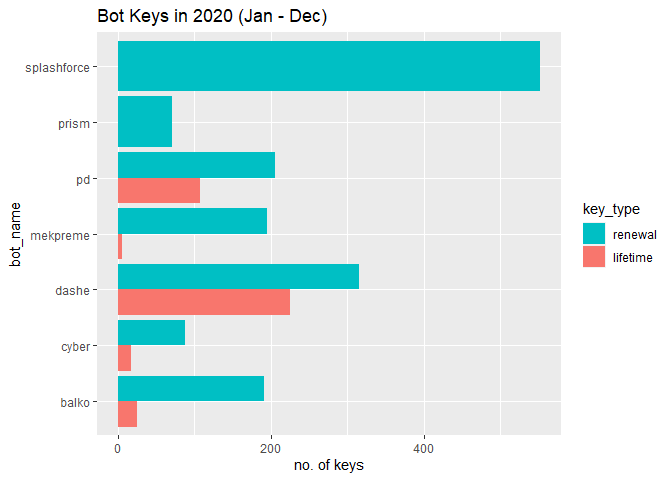
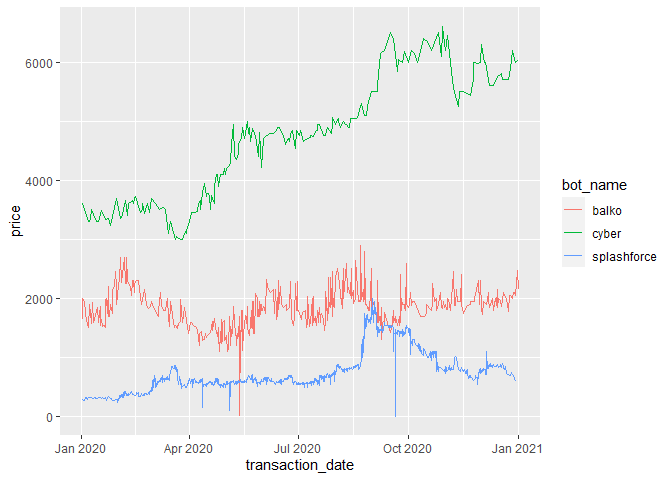
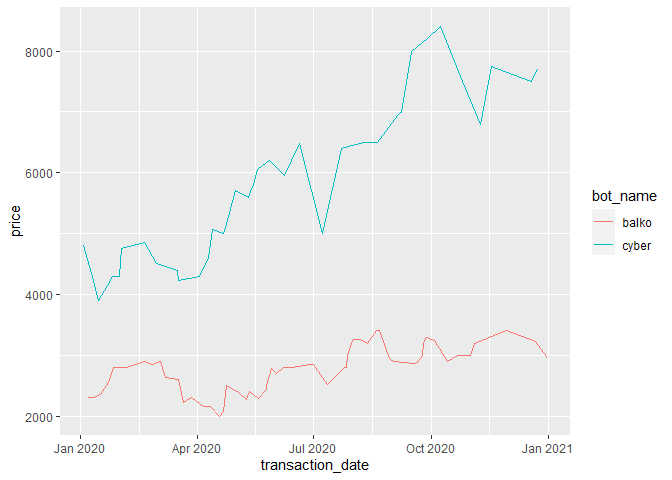
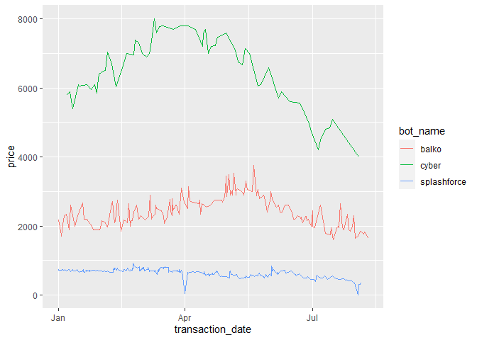
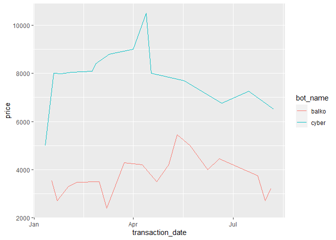

# This is a project about bots... sneaker bots!

This is a passion project to practice my data analysis skills with R, while combining my love for the world of sneakers. 

With sneakers become more and more coveted, and a wider number of people getting into them, some have turned to using "bots", which use a combination of unconventional and interesting methods to allow a user to run hundreds of tasks (appearing as hundres of unique users with the help of residential / data center proxies) on a given website. This allows the botter to have a higher chance of not only getting limited shoes, but also in volumes that the average person would almost find impossible to do manually without it.

Bots are created by different software developers, and thus vary in their quality and performance on different sites. This project just aims to show trends between certain bots, and why some are cheaper than others.

This project analyzes data from [the BotBroker website](https://botbroker.io/bots), pulled out from the website as a list of lists with the help of Postman. 

The data in this project was pulled on the 11th of August, 2021. 

Let's see how this turns out!

First, we'll install the necessary packages if you need them.

```r
## install.packages("tidyverse")
## install.packages("jsonlite")
## install.packages("lubridate")
```

Next, run the packages.

```r
library(tidyverse)
library(jsonlite)
library(lubridate)
```

## Initial data pull

We'll first construct a snippet that can efficiently allow us to convert file path backslashes to forward slashes. You can insert this code into your global options. For a more detailed explanation snippets, you can [find it on rstudio](https://support.rstudio.com/hc/en-us/articles/204463668-Code-Snippets). You could also use a program like Path Copy Copy.


```r
## snippet pp
##    "`r gsub('"', "", gsub("\\\\", "/", readClipboard()))`"
```

At this point, there are 27 json files that need to be converted into a huge data frame containing all bot transaction data. 

The additional obstacle is that some have lifetime copies, and some only have renewal copies.

The endgame of this data should contain

1. A column of factors containing bot names
2. Date time column of transaction (in datetime format)
3. Price transacted (int)
4. A column that differentiates lifetime and renewal copies (which could also be factors)
5. What sites the bot supports (Shopify, YeezySupply, Footsites, Supreme)

### Converting JSON files into R objects

After the data was pulled from Botbroker, they were extracted as JSON files with the help of Postman, and transformed to an R friendly format using the function `fromJSON()` from the `jsonlite` library.

This converts the JSON file into two character columns, transaction time and price sold.

Note backslashes have to be converted to forward slashes.


```r
balko_lt <- fromJSON("C:/Users/herkm/Desktop/R Workspace/sneaker-bots-R/bot-data/balko_lt.json")
balko_r <- fromJSON("C:/Users/herkm/Desktop/R Workspace/sneaker-bots-R/bot-data/balko_renewal.json")
carnage_r <- fromJSON("C:/Users/herkm/Desktop/R Workspace/sneaker-bots-R/bot-data/carnage_renewal.json")
cyber_lt <- fromJSON("C:/Users/herkm/Desktop/R Workspace/sneaker-bots-R/bot-data/cyber_lt.json")
cyber_r <- fromJSON("C:/Users/herkm/Desktop/R Workspace/sneaker-bots-R/bot-data/cyber_renewal.json")
dashe_lt <- fromJSON("C:/Users/herkm/Desktop/R Workspace/sneaker-bots-R/bot-data/dashe_lt.json")
dashe_r <- fromJSON("C:/Users/herkm/Desktop/R Workspace/sneaker-bots-R/bot-data/dashe_renewal.json")
ganesh_lt <- fromJSON("C:/Users/herkm/Desktop/R Workspace/sneaker-bots-R/bot-data/ganesh_lt.json")
ganesh_r <- fromJSON("C:/Users/herkm/Desktop/R Workspace/sneaker-bots-R/bot-data/ganesh_renewal.json")
kage_r <- fromJSON("C:/Users/herkm/Desktop/R Workspace/sneaker-bots-R/bot-data/kage_renewal.json")
mekaio_r <- fromJSON("C:/Users/herkm/Desktop/R Workspace/sneaker-bots-R/bot-data/mekaio_renewal.json")
mekpreme_lt <- fromJSON("C:/Users/herkm/Desktop/R Workspace/sneaker-bots-R/bot-data/mekpreme_lt.json")
mekpreme_r <- fromJSON("C:/Users/herkm/Desktop/R Workspace/sneaker-bots-R/bot-data/mekpreme_renewal.json")
nebula_lt <- fromJSON("C:/Users/herkm/Desktop/R Workspace/sneaker-bots-R/bot-data/nebula_lt.json")
nebula_r <- fromJSON("C:/Users/herkm/Desktop/R Workspace/sneaker-bots-R/bot-data/nebula_renewal.json")
ominous_r <- fromJSON("C:/Users/herkm/Desktop/R Workspace/sneaker-bots-R/bot-data/ominous_renewal.json")
pd_lt <- fromJSON("C:/Users/herkm/Desktop/R Workspace/sneaker-bots-R/bot-data/pd_lt.json")
pd_r <- fromJSON("C:/Users/herkm/Desktop/R Workspace/sneaker-bots-R/bot-data/pd_renewal.json")
prism_r <- fromJSON("C:/Users/herkm/Desktop/R Workspace/sneaker-bots-R/bot-data/prism_renewal.json")
scottbot_r <- fromJSON("C:/Users/herkm/Desktop/R Workspace/sneaker-bots-R/bot-data/scottbot_renewal.json")
splashforce_r <- fromJSON("C:/Users/herkm/Desktop/R Workspace/sneaker-bots-R/bot-data/splashforce_renewal.json")
swftaio_r <- fromJSON("C:/Users/herkm/Desktop/R Workspace/sneaker-bots-R/bot-data/swftaio_renewal.json")
tohru_r <- fromJSON("C:/Users/herkm/Desktop/R Workspace/sneaker-bots-R/bot-data/tohru_renewal.json")
velox_lt <- fromJSON("C:/Users/herkm/Desktop/R Workspace/sneaker-bots-R/bot-data/velox_lifetime.json")
velox_r <- fromJSON("C:/Users/herkm/Desktop/R Workspace/sneaker-bots-R/bot-data/velox_renewal.json")
wrath_lt <- fromJSON("C:/Users/herkm/Desktop/R Workspace/sneaker-bots-R/bot-data/wrath_lifetime.json")
wrath_r <- fromJSON("C:/Users/herkm/Desktop/R Workspace/sneaker-bots-R/bot-data/wrath_renewal.json")
```

## Transforming data into correct data types 

This process returns us a 2 column character matrix, of transaction date and price that looks like this:


```r
str(balko_lt)
```

```
##  chr [1:359, 1:2] "2019-12-29T20:35:42.818Z" "2019-12-10T22:02:22.849Z" ...
```

```r
head(balko_lt)
```

```
##      [,1]                       [,2]  
## [1,] "2019-12-29T20:35:42.818Z" "2490"
## [2,] "2019-12-10T22:02:22.849Z" "2200"
## [3,] "2019-12-20T03:11:07.109Z" "1510"
## [4,] "2019-12-24T13:47:05.384Z" "1910"
## [5,] "2020-01-12T17:12:10.301Z" "2300"
## [6,] "2020-01-16T00:12:52.320Z" "2350"
```
Thus, we'll have to rename and change the columns into the right data types - date time and numeric before we go further, which also forces us to turn these matrixes into tibbles for easy wrangling later on.

We'll first turn this matrix into a tibble.


```r
balko_lt_e <- balko_lt %>% 
  as_tibble() %>% 
  set_names(c("transaction_date", "price"))
```

```
## Warning: The `x` argument of `as_tibble.matrix()` must have unique column names if `.name_repair` is omitted as of tibble 2.0.0.
## Using compatibility `.name_repair`.
```
Next, we'll turn the columns into the right datatypes.


```r
balko_lt_e <- balko_lt_e %>%
  mutate(price = as.numeric(unlist(balko_lt_e$price))) %>% 
  mutate(transaction_date = as_datetime(str_replace_all(balko_lt_e$transaction_date, "T|Z", " ")))

str(balko_lt_e)
```

```
## tibble [359 x 2] (S3: tbl_df/tbl/data.frame)
##  $ transaction_date: POSIXct[1:359], format: "2019-12-29 20:35:42" "2019-12-10 22:02:22" ...
##  $ price           : num [1:359] 2490 2200 1510 1910 2300 ...
```
Now that one is done, all we have to do is do it another 26 times :)


```r
balko_r_e <- balko_r %>% 
  as_tibble() %>% 
  set_names(c("transaction_date", "price"))

balko_r_e <- balko_r_e %>%
  mutate(price = as.numeric(unlist(balko_r_e$price))) %>% 
  mutate(transaction_date = as_datetime(str_replace_all(balko_r_e$transaction_date, "T|Z", " ")))

str(balko_r_e)
```

```
## tibble [2,351 x 2] (S3: tbl_df/tbl/data.frame)
##  $ transaction_date: POSIXct[1:2351], format: "2020-02-02 23:05:38" "2019-12-20 01:29:09" ...
##  $ price           : num [1:2351] 2699 1576 1990 1700 1774 ...
```

It's probably time to create some functions...


```r
bb_tibbler <- function(bot_data) {
  bot_data %>% 
  as_tibble() %>% 
  set_names(c("transaction_date", "price"))
}

bb_tibbled_formatter <- function(bot_df) {
  bot_df %>% 
  mutate(price = as.numeric(unlist(bot_df$price))) %>% 
  mutate(transaction_date = as_datetime(str_replace_all(bot_df$transaction_date, "T|Z", " ")))
}
```

Alright, on with the rest of the bots. (output is hidden for brevity)


### Mutate() for the additional data we need before joining tables together

Before we join the tables, we need to first `mutate()` two columns onto each tibble, one that shows the key type (lifetime or renewal) of the bot, and another that shows the name of the bot (so we can have a tidy, long rather that wide, dataset) before we join all rows together to form a giant dataframe of all bots.

The tables should all have four variables with the same column names, ordered as such: `bot_name`, `key_type`, `transaction_date`, and `price`. We'll do this with the help of `select()`. Output is hidden for brevity, but we will be running the following code for each bot.


```r
#balko
balko_lt_e <- balko_lt_e %>% 
  mutate(key_type = "lifetime", bot_name = "balko") %>% 
  arrange(transaction_date) %>% 
  select(bot_name, key_type, transaction_date, price)
```


### Time to join tables!

Now that all JSON files have been wrangled into tibbles with the right data types, it's time to join tables that have both renewal and lifetime copies.

These bots are - balko, cyber, dashe, ganesh, mekpreme, nebula, pd, velox, and wrath.

We'll use the `bind_rows()` function from `dplyr` to achieve this.


```r
balko_lt_r_e <- bind_rows(balko_lt_e, balko_r_e)
cyber_lt_r_e <- bind_rows(cyber_lt_e, cyber_r_e)
dashe_lt_r_e <- bind_rows(dashe_lt_e, dashe_r_e)
ganesh_lt_r_e <- bind_rows(ganesh_lt_e, ganesh_r_e)
mekpreme_lt_r_e <- bind_rows(mekpreme_lt_e, mekpreme_r_e)
nebula_lt_r_e <- bind_rows(nebula_lt_e, nebula_r_e)
pd_lt_r_e <- bind_rows(pd_lt_e, pd_r_e)
velox_lt_r_e <- bind_rows(velox_lt_e, velox_r_e)
wrath_lt_r_e <- bind_rows(wrath_lt_e, wrath_r_e)
```

With that done, let's bind all bot transaction data into one long, tidy tibble.


```r
bot_txns_compiled <- bind_rows(balko_lt_r_e, carnage_r_e, cyber_lt_r_e, dashe_lt_r_e, ganesh_lt_r_e, kage_r_e, mekaio_r_e, mekpreme_lt_r_e, nebula_lt_r_e, ominous_r_e, pd_lt_r_e, prism_r_e, scottbot_r_e, splashforce_r_e, swftaio_r_e, tohru_r_e, velox_lt_r_e, wrath_lt_r_e)

head(bot_txns_compiled)
```

```
## # A tibble: 6 x 4
##   bot_name key_type transaction_date    price
##   <chr>    <chr>    <dttm>              <dbl>
## 1 balko    lifetime 2019-05-27 01:19:28  2000
## 2 balko    lifetime 2019-05-27 06:49:38  2700
## 3 balko    lifetime 2019-05-27 10:33:28  2350
## 4 balko    lifetime 2019-05-27 21:27:04  2040
## 5 balko    lifetime 2019-05-27 23:27:18  2100
## 6 balko    lifetime 2019-05-28 14:51:09  2225
```

```r
str(bot_txns_compiled)
```

```
## tibble [32,662 x 4] (S3: tbl_df/tbl/data.frame)
##  $ bot_name        : chr [1:32662] "balko" "balko" "balko" "balko" ...
##  $ key_type        : chr [1:32662] "lifetime" "lifetime" "lifetime" "lifetime" ...
##  $ transaction_date: POSIXct[1:32662], format: "2019-05-27 01:19:28" "2019-05-27 06:49:38" ...
##  $ price           : num [1:32662] 2000 2700 2350 2040 2100 ...
```

## Different bots bot different sites

One of the other things we should add at this point is what sites the bots support. The main sites to consider are Shopify, Footsites (FootLocker, Eastbay, Champs, FootAction), YeezySupply, Supreme, Collectibles (Funko), Retail (amazon, walmart), Mesh(JD, footpatrol, size?), Off-white, and EU sites (Snipes, Net-a-porter, Offspring, NAKED, Starcow, SVD, Courier, Slam Jam, Solebox, Zalando). 

To prevent data clutter, all EU sites will be consolidated under one column, as not many bots specialize in it, and those that do usually cover the full suite.

As we will be converting them into factors later on, if the bot supports a site, the value will be the site name (e.g. `shopify`), but if it does not, the value in the column will have 'no' in front of it (e.g. `no_shopify`) so we can assign levels to each column later on.

Also, columns need to be created for bots that are US focused, and EU focused.

Alright, onto the next `mutate()` chunk.


Almost ready to bind all of these tibbles together...

### Is there a better way to present the data we have?

After looking at how the data shaped up, it seems like it might be better to separate the site coverage of bots to a separate table, while keeping transactions in a separate table, to prevent unnecessary repetition, so let's get to work on that!

This also allows us to get a nice overview of the bot ecosystem, and bots that are performing well whose transactions are not supported on botbroker.

What bots are there?
aiomoji, balko, burst, cyber, dashe, dragon, earthside, ecb, estock, eve, f3, flare, ganesh, hawkmesh, hayha, ignite, kage, koi, kodai, kylin, lexaio, linear, mbot, mekaio, mekpreme, noble, nsb, nyte, ominous, pd, prism, qbot, reaio, stellar, solar, sole, splashforce, tohru, trickle, thunder, valor, velox, viper, whatbot, wrath

There are of course, bots that have been taken out of this analysis. Low tier Mobile bots (Polar, Quick Cop, etc), inactive bots (Fleek, Ghost, Phasma), raffle bots (infinit, thunder raffle, flare raffle, kicksrafflebot), bots that are difficult to sell (TSB, Rafflehub, Diao, etc), and private bots.

Bots in this list all have keys that can be sold or bought easily.

1. aiomoji - footsites (ASIA)
2. balko - shopify, collectibles, offwhite
3. burst - offwhite, eu sites
4. carnage - collectibles, eu sites, retail
5. cyber - shopify, footsites (EU, ASIA), yeezysupply, supreme, mobile, offwhite, collectibles
6. dashe - yeezysupply, supreme
7. dragon- nike_backend
8. earthside - eu sites
9. ecb - footsites (US)
10. estock - retail
11. eve - retail
12. f3 - supreme, mobile
13. flare - mesh, footsites (EU), eu sites
14. fluid - retail
15. ganesh - mesh, footlocker (US, EU, ASIA), yeezysupply, eu sites, adidas (US, EU), offwhite
16. hawkmesh - mesh
17. hayha - footsites (US), retail, new balance
18. ignite - footsites (US), retail
19. kage - shopify, footsites (US), retail
20. kodai - footsites (US, EU, ASIA), yeezysupply, supreme
21. koi - retail
22. kylin - footsites (US, EU, ASIA), yeezysupply, adidas (US, EU, ASIA)
23. lexaio - retail
24. linear- footsites (US), nike_backend, nike_snkrs
25. mbot - offwhite, mesh, mobile
26. mekaio- shopify, footsites (US), yeezysupply
27. mekpreme - supreme
28. nebula - shopify, footsites (US), yeezysupply
29. noble - footsites (US)
30. nsb - shopify, footsites (US), yeezysupply
31. nyte - footsites (US), yeezysupply
32. ominous - footsites (US), yeezysupply, retail
33. pd - shopify, yeezysupply, footsites (US)
34. prism - shopify, yeezysupply, footsites (US)
35. qbot - footsites (ASIA)
36. reaio - nike_backend, nike_snkrs, footsites, supreme
37. schrysant - supreme
38. scottbot - collectibles
39. stellar - retail
40. solar - mesh, eu sites
41. sole - shopify, adidas (US, EU), yeezysupply
42. swftaio - retail, mobile, collectibles
43. splashforce - footsites (US), yeezysupply
44. tohru - footsites (US), yeezysupply, supreme, nike_backend
45. trickle - shopify, yeezysupply, retail
46. thunder - mesh, eu sites, offwhite
47. valor - footsites (US), yeezysupply, supreme
48. velox - supreme, yeezysupply
49. whatbot - footsites (US), yeezysupply
50. wrath - shopify, footsites (US), yeezysupply, supreme

Just for some practice on constructing a dataframe from separate vectors... (output is hidden for brevity)


This is how our final long dataframe looks like:


```r
head(bot_data_compiled)
```

```
## # A tibble: 6 x 14
##   bot_name_id shopify  footsites yeezysupply supreme retail mesh  eu_sites nike 
##   <chr>       <chr>    <chr>     <chr>       <chr>   <chr>  <chr> <chr>    <chr>
## 1 aiomoji     no_shop~ footsite~ no_yeezysu~ no_sup~ no_re~ no_m~ no_eu_s~ no_n~
## 2 balko       shopify  no_foots~ no_yeezysu~ no_sup~ no_re~ no_m~ no_eu_s~ no_n~
## 3 burst       no_shop~ no_foots~ no_yeezysu~ no_sup~ no_re~ no_m~ eu_sites no_n~
## 4 carnage     no_shop~ no_foots~ no_yeezysu~ no_sup~ retail no_m~ eu_sites no_n~
## 5 cyber       shopify  all_regi~ yeezysupply supreme no_re~ no_m~ no_eu_s~ no_n~
## 6 dashe       no_shop~ no_foots~ yeezysupply supreme no_re~ no_m~ no_eu_s~ no_n~
## # ... with 5 more variables: adidas <chr>, new_balance <chr>, offwhite <chr>,
## #   collectibles <chr>, mobile <chr>
```

```r
str(bot_data_compiled)
```

```
## tibble [50 x 14] (S3: tbl_df/tbl/data.frame)
##  $ bot_name_id : chr [1:50] "aiomoji" "balko" "burst" "carnage" ...
##  $ shopify     : chr [1:50] "no_shopify" "shopify" "no_shopify" "no_shopify" ...
##  $ footsites   : chr [1:50] "footsites_asia" "no_footsites" "no_footsites" "no_footsites" ...
##  $ yeezysupply : chr [1:50] "no_yeezysupply" "no_yeezysupply" "no_yeezysupply" "no_yeezysupply" ...
##  $ supreme     : chr [1:50] "no_supreme" "no_supreme" "no_supreme" "no_supreme" ...
##  $ retail      : chr [1:50] "no_retail" "no_retail" "no_retail" "retail" ...
##  $ mesh        : chr [1:50] "no_mesh" "no_mesh" "no_mesh" "no_mesh" ...
##  $ eu_sites    : chr [1:50] "no_eu_sites" "no_eu_sites" "eu_sites" "eu_sites" ...
##  $ nike        : chr [1:50] "no_nike" "no_nike" "no_nike" "no_nike" ...
##  $ adidas      : chr [1:50] "no_adidas" "no_adidas" "no_adidas" "no_adidas" ...
##  $ new_balance : chr [1:50] "no_new_balance" "no_new_balance" "no_new_balance" "no_new_balance" ...
##  $ offwhite    : chr [1:50] "no_offwhite" "offwhite" "offwhite" "no_offwhite" ...
##  $ collectibles: chr [1:50] "no_collectibles" "collectibles" "no_collectibles" "collectibles" ...
##  $ mobile      : chr [1:50] "no_mobile" "no_mobile" "no_mobile" "no_mobile" ...
```

### The two data frames we've created

At this point, we've created **two dataframes** - `bot_data_compiled`, and `bot_txns_compiled`, but some final manipulation needs to be done to help us have a smoother time with data analysis later on.

## Factor Time

As we can see from the data currently, all columns are currently character strings, when they can be turned into factors for our analysis. Time to use the some base functions like `factor()` and the `forcats` package to help us.

With a full table of character columns, this might be the most efficient way to change all of them into factors. 


```r
bot_data_compiled <- bot_data_compiled %>% 
  mutate_if(is.character, as_factor)

str(bot_data_compiled)
```

```
## tibble [50 x 14] (S3: tbl_df/tbl/data.frame)
##  $ bot_name_id : Factor w/ 50 levels "aiomoji","balko",..: 1 2 3 4 5 6 7 8 9 10 ...
##  $ shopify     : Factor w/ 2 levels "no_shopify","shopify": 1 2 1 1 2 1 1 1 1 1 ...
##  $ footsites   : Factor w/ 5 levels "footsites_asia",..: 1 2 2 2 3 2 2 2 4 2 ...
##  $ yeezysupply : Factor w/ 2 levels "no_yeezysupply",..: 1 1 1 1 2 2 1 1 1 1 ...
##  $ supreme     : Factor w/ 2 levels "no_supreme","supreme": 1 1 1 1 2 2 1 1 1 1 ...
##  $ retail      : Factor w/ 2 levels "no_retail","retail": 1 1 1 2 1 1 1 1 1 2 ...
##  $ mesh        : Factor w/ 2 levels "no_mesh","mesh": 1 1 1 1 1 1 1 1 1 1 ...
##  $ eu_sites    : Factor w/ 2 levels "no_eu_sites",..: 1 1 2 2 1 1 1 1 2 1 ...
##  $ nike        : Factor w/ 3 levels "no_nike","nike_webstore",..: 1 1 1 1 1 1 2 1 1 1 ...
##  $ adidas      : Factor w/ 3 levels "no_adidas","adidas_us & eu",..: 1 1 1 1 1 1 1 1 1 1 ...
##  $ new_balance : Factor w/ 2 levels "no_new_balance",..: 1 1 1 1 1 1 1 1 1 1 ...
##  $ offwhite    : Factor w/ 2 levels "no_offwhite",..: 1 2 2 1 2 1 1 1 1 1 ...
##  $ collectibles: Factor w/ 2 levels "no_collectibles",..: 1 2 1 2 2 1 1 1 1 1 ...
##  $ mobile      : Factor w/ 2 levels "no_mobile","mobile": 1 1 1 1 2 1 1 1 1 1 ...
```

```r
levels(bot_data_compiled$footsites)
```

```
## [1] "footsites_asia"        "no_footsites"          "all_regions_footsites"
## [4] "footsites_us"          "footsites_eu"
```
At the moment, some factors aren't organized in the same way that the rest are (e.g. the absence of a site is not the first level), so lets get that sorted with `forcats::fct_relevel`.


```r
bot_data_compiled$footsites <- fct_relevel(bot_data_compiled$footsites, c("no_footsites", "footsites_us", "footsites_eu", "footsites_asia", "all_regions_footsites"))

levels(bot_data_compiled$footsites)
```

```
## [1] "no_footsites"          "footsites_us"          "footsites_eu"         
## [4] "footsites_asia"        "all_regions_footsites"
```

```r
str(bot_data_compiled)
```

```
## tibble [50 x 14] (S3: tbl_df/tbl/data.frame)
##  $ bot_name_id : Factor w/ 50 levels "aiomoji","balko",..: 1 2 3 4 5 6 7 8 9 10 ...
##  $ shopify     : Factor w/ 2 levels "no_shopify","shopify": 1 2 1 1 2 1 1 1 1 1 ...
##  $ footsites   : Factor w/ 5 levels "no_footsites",..: 4 1 1 1 5 1 1 1 2 1 ...
##  $ yeezysupply : Factor w/ 2 levels "no_yeezysupply",..: 1 1 1 1 2 2 1 1 1 1 ...
##  $ supreme     : Factor w/ 2 levels "no_supreme","supreme": 1 1 1 1 2 2 1 1 1 1 ...
##  $ retail      : Factor w/ 2 levels "no_retail","retail": 1 1 1 2 1 1 1 1 1 2 ...
##  $ mesh        : Factor w/ 2 levels "no_mesh","mesh": 1 1 1 1 1 1 1 1 1 1 ...
##  $ eu_sites    : Factor w/ 2 levels "no_eu_sites",..: 1 1 2 2 1 1 1 1 2 1 ...
##  $ nike        : Factor w/ 3 levels "no_nike","nike_webstore",..: 1 1 1 1 1 1 2 1 1 1 ...
##  $ adidas      : Factor w/ 3 levels "no_adidas","adidas_us & eu",..: 1 1 1 1 1 1 1 1 1 1 ...
##  $ new_balance : Factor w/ 2 levels "no_new_balance",..: 1 1 1 1 1 1 1 1 1 1 ...
##  $ offwhite    : Factor w/ 2 levels "no_offwhite",..: 1 2 2 1 2 1 1 1 1 1 ...
##  $ collectibles: Factor w/ 2 levels "no_collectibles",..: 1 2 1 2 2 1 1 1 1 1 ...
##  $ mobile      : Factor w/ 2 levels "no_mobile","mobile": 1 1 1 1 2 1 1 1 1 1 ...
```
## Exploratory Data Analysis - Where Is The Opportunity For Bot Devs?

We can first do a simple breakdown, where we take a look at where upcoming bots could consider focusing on, as some sites already are over-saturated with bots.


```r
#shopify breakdown
bot_data_compiled %>% 
  group_by(shopify) %>% 
  summarize(n = n()) %>% 
  mutate(percent = n / sum(n) * 100)
```

```
## # A tibble: 2 x 3
##   shopify        n percent
##   <fct>      <int>   <dbl>
## 1 no_shopify    39      78
## 2 shopify       11      22
```

```r
#footsites breakdown
bot_data_compiled %>% 
  group_by(footsites) %>% 
  summarize(n = n()) %>% 
  mutate(percent = n / sum(n) * 100)
```

```
## # A tibble: 5 x 3
##   footsites                 n percent
##   <fct>                 <int>   <dbl>
## 1 no_footsites             25      50
## 2 footsites_us             18      36
## 3 footsites_eu              1       2
## 4 footsites_asia            2       4
## 5 all_regions_footsites     4       8
```

```r
#yeezysupply breakdown
bot_data_compiled %>% 
  group_by(yeezysupply) %>% 
  summarize(n = n()) %>% 
  mutate(percent = n / sum(n) * 100)
```

```
## # A tibble: 2 x 3
##   yeezysupply        n percent
##   <fct>          <int>   <dbl>
## 1 no_yeezysupply    30      60
## 2 yeezysupply       20      40
```

```r
#supreme breakdown
bot_data_compiled %>% 
  group_by(supreme) %>% 
  summarize(n = n())%>% 
  mutate(percent = n / sum(n) * 100)
```

```
## # A tibble: 2 x 3
##   supreme        n percent
##   <fct>      <int>   <dbl>
## 1 no_supreme    39      78
## 2 supreme       11      22
```

```r
#retail
bot_data_compiled %>% 
  group_by(retail) %>% 
  summarize(n = n()) %>% 
  mutate(percent = n / sum(n) * 100)
```

```
## # A tibble: 2 x 3
##   retail        n percent
##   <fct>     <int>   <dbl>
## 1 no_retail    38      76
## 2 retail       12      24
```

```r
#mesh
bot_data_compiled %>% 
  group_by(mesh) %>% 
  summarize(n = n()) %>% 
  mutate(percent = n / sum(n) * 100)
```

```
## # A tibble: 2 x 3
##   mesh        n percent
##   <fct>   <int>   <dbl>
## 1 no_mesh    44      88
## 2 mesh        6      12
```

```r
#eu_sites
bot_data_compiled %>% 
  group_by(eu_sites) %>% 
  summarize(n = n()) %>% 
  mutate(percent = n / sum(n) * 100)
```

```
## # A tibble: 2 x 3
##   eu_sites        n percent
##   <fct>       <int>   <dbl>
## 1 no_eu_sites    43      86
## 2 eu_sites        7      14
```

```r
#nike 
bot_data_compiled %>% 
  group_by(nike) %>% 
  summarize(n = n()) %>% 
  mutate(percent = n / sum(n) * 100)
```

```
## # A tibble: 3 x 3
##   nike                      n percent
##   <fct>                 <int>   <dbl>
## 1 no_nike                  46      92
## 2 nike_webstore             2       4
## 3 nike_webstore & snkrs     2       4
```

```r
#adidas
bot_data_compiled %>% 
  group_by(adidas) %>% 
  summarize(n = n()) %>% 
  mutate(percent = n / sum(n) * 100)
```

```
## # A tibble: 3 x 3
##   adidas                 n percent
##   <fct>              <int>   <dbl>
## 1 no_adidas             47      94
## 2 adidas_us & eu         2       4
## 3 adidas_all_regions     1       2
```

```r
#new_balance
bot_data_compiled %>% 
  group_by(new_balance) %>% 
  summarize(n = n()) %>% 
  mutate(percent = n / sum(n) * 100)
```

```
## # A tibble: 2 x 3
##   new_balance        n percent
##   <fct>          <int>   <dbl>
## 1 no_new_balance    49      98
## 2 new_balance        1       2
```

```r
#off_white
bot_data_compiled %>% 
  group_by(offwhite) %>% 
  summarize(n = n()) %>% 
  mutate(percent = n / sum(n) * 100)
```

```
## # A tibble: 2 x 3
##   offwhite        n percent
##   <fct>       <int>   <dbl>
## 1 no_offwhite    45      90
## 2 offwhite        5      10
```

```r
#collectibles
bot_data_compiled %>% 
  group_by(collectibles) %>% 
  summarize(n = n()) %>% 
  mutate(percent = n / sum(n) * 100)
```

```
## # A tibble: 2 x 3
##   collectibles        n percent
##   <fct>           <int>   <dbl>
## 1 no_collectibles    46      92
## 2 collectibles        4       8
```

```r
#mobile
bot_data_compiled %>% 
  group_by(mobile) %>% 
  summarize(n = n()) %>% 
  mutate(percent = n / sum(n) * 100)
```

```
## # A tibble: 2 x 3
##   mobile        n percent
##   <fct>     <int>   <dbl>
## 1 no_mobile    46      92
## 2 mobile        4       8
```
From the results, we can easily narrow down the most hotly contested sites among bot developers - **US footsites** (18/50 bots support) and **yeezysupply** (20/50 bots support). Of course, this is in part due to the number of drops that happen on these two sites, and the potential profits that botters can make from them.

However, there are some sites that are extremely popular, yet few bot developers specialize in it - sites like **footlocker EU** and **footlocker ASIA** hardly have any bots that support it.

```r
bot_data_compiled %>% 
  filter(footsites == "footsites_eu" | footsites == "footsites_asia" | footsites == "all_regions_footsites")
```

```
## # A tibble: 7 x 14
##   bot_name_id shopify  footsites yeezysupply supreme retail mesh  eu_sites nike 
##   <fct>       <fct>    <fct>     <fct>       <fct>   <fct>  <fct> <fct>    <fct>
## 1 aiomoji     no_shop~ footsite~ no_yeezysu~ no_sup~ no_re~ no_m~ no_eu_s~ no_n~
## 2 cyber       shopify  all_regi~ yeezysupply supreme no_re~ no_m~ no_eu_s~ no_n~
## 3 flare       no_shop~ footsite~ no_yeezysu~ no_sup~ no_re~ mesh  no_eu_s~ no_n~
## 4 ganesh      no_shop~ all_regi~ yeezysupply no_sup~ no_re~ mesh  no_eu_s~ no_n~
## 5 kodai       no_shop~ all_regi~ yeezysupply supreme no_re~ no_m~ no_eu_s~ no_n~
## 6 kylin       no_shop~ all_regi~ yeezysupply no_sup~ no_re~ no_m~ no_eu_s~ no_n~
## 7 qbot        no_shop~ footsite~ no_yeezysu~ no_sup~ no_re~ no_m~ no_eu_s~ no_n~
## # ... with 5 more variables: adidas <fct>, new_balance <fct>, offwhite <fct>,
## #   collectibles <fct>, mobile <fct>
```
This is a business opportunity for bot developers thinking of creating a new bot, as there is almost a monopoly on non-US footsites by bots like Qbot and Ganesh who perform miles better than most other bots on footlocker ASIA and EU respectively.

However, the difficulty of botting footlocker is compounded by the fact that their sites are split according to NEW and OLD regions, requiring completely different scripts between both regions.

At the end of the day, this is a potential area for future bot devs to look into.

The other opportunity lies in creating a great shopify bot, as there are not many bots that consistently work across shopify sites.


```r
bot_data_compiled %>% 
  filter(shopify == "shopify")
```

```
## # A tibble: 11 x 14
##    bot_name_id shopify footsites yeezysupply supreme retail mesh  eu_sites nike 
##    <fct>       <fct>   <fct>     <fct>       <fct>   <fct>  <fct> <fct>    <fct>
##  1 balko       shopify no_foots~ no_yeezysu~ no_sup~ no_re~ no_m~ no_eu_s~ no_n~
##  2 cyber       shopify all_regi~ yeezysupply supreme no_re~ no_m~ no_eu_s~ no_n~
##  3 kage        shopify footsite~ no_yeezysu~ no_sup~ retail no_m~ no_eu_s~ no_n~
##  4 mekaio      shopify footsite~ yeezysupply no_sup~ no_re~ no_m~ no_eu_s~ no_n~
##  5 nebula      shopify footsite~ yeezysupply no_sup~ no_re~ no_m~ no_eu_s~ no_n~
##  6 nsb         shopify footsite~ yeezysupply no_sup~ no_re~ no_m~ no_eu_s~ no_n~
##  7 pd          shopify footsite~ yeezysupply no_sup~ no_re~ no_m~ no_eu_s~ no_n~
##  8 prism       shopify footsite~ yeezysupply no_sup~ no_re~ no_m~ no_eu_s~ no_n~
##  9 sole        shopify no_foots~ yeezysupply no_sup~ no_re~ no_m~ no_eu_s~ no_n~
## 10 trickle     shopify no_foots~ yeezysupply no_sup~ retail no_m~ no_eu_s~ no_n~
## 11 wrath       shopify footsite~ yeezysupply supreme no_re~ no_m~ no_eu_s~ no_n~
## # ... with 5 more variables: adidas <fct>, new_balance <fct>, offwhite <fct>,
## #   collectibles <fct>, mobile <fct>
```
Out of these bots, the ones that perform phenomenally well at the moment are balko, wrath, and mek. Other bots are spotty at best on shopify, and the crown lies with these 3 bots. 

My advice for a bot dev now would be to create a bot that is strong at **shopify and all footsites** - Similar to a bot like Kylin, but better. That would be the best way to create a bot that is wanted by the community, and also hold strong resell value.

Of course, it's important to note the "niche" sites that some bots support, like Adidas, New Balance, or Nike. These sites usually require a huge amount of developer time investment, for little return (apart from Adidas bots and pure Nike bots), and as such do not present a good opportunity for bot devs.

If a developer was looking to expand to one of these sites, I would recommend Adidas or New Balance.

## Exploratory Data Analysis - Where Is The Opportunity For Bot Users?

Now that we've done some preliminary analysis on what sites bots support, let's refer back to the transaction lists for the bots we have data on, `bot_txns_compiled`

We'll first need to make sure bot_names and key types are factors, as they are currently in character format.


```r
bot_txns_compiled <- bot_txns_compiled %>% 
  mutate_if(is.character, as_factor)

str(bot_txns_compiled)
```

```
## tibble [32,662 x 4] (S3: tbl_df/tbl/data.frame)
##  $ bot_name        : Factor w/ 18 levels "balko","carnage",..: 1 1 1 1 1 1 1 1 1 1 ...
##  $ key_type        : Factor w/ 2 levels "lifetime","renewal": 1 1 1 1 1 1 1 1 1 1 ...
##  $ transaction_date: POSIXct[1:32662], format: "2019-05-27 01:19:28" "2019-05-27 06:49:38" ...
##  $ price           : num [1:32662] 2000 2700 2350 2040 2100 ...
```

```r
levels(bot_txns_compiled$key_type)
```

```
## [1] "lifetime" "renewal"
```
Alright, we're good. Now, we'll try to look at some of the factors that affect price of lifetime vs renewal key in 2020. We'll first have to nail down which bots were on botbroker in 2020, from January, and check out when the firs transactions happened as well.

### Bot Fever in 2020 - Fuelled By COVID


```r
bot_txns_compiled %>%
    filter(transaction_date >= date("2020-01-01"), transaction_date <= date("2020-01-31")) %>% 
    arrange(bot_name, key_type, transaction_date) %>%
    group_by(bot_name, key_type) %>%
    top_n(1) %>% 
    arrange(desc(price))
```

```
## Selecting by price
```

```
## # A tibble: 12 x 4
## # Groups:   bot_name, key_type [12]
##    bot_name    key_type transaction_date    price
##    <fct>       <fct>    <dttm>              <dbl>
##  1 cyber       lifetime 2020-01-03 03:44:05  4800
##  2 cyber       renewal  2020-01-24 17:01:42  3700
##  3 balko       lifetime 2020-01-27 02:32:36  2900
##  4 balko       renewal  2020-01-29 16:39:32  2450
##  5 mekpreme    lifetime 2020-01-08 18:32:12  1200
##  6 pd          lifetime 2020-01-26 19:15:19   896
##  7 prism       renewal  2020-01-07 00:07:09   800
##  8 mekpreme    renewal  2020-01-11 11:09:05   585
##  9 pd          renewal  2020-01-10 14:49:16   550
## 10 dashe       lifetime 2020-01-10 01:56:51   415
## 11 splashforce renewal  2020-01-24 00:56:44   350
## 12 dashe       renewal  2020-01-30 21:35:54   175
```
Many of these bots at the time were at pretty stable prices in line with what they've been for at least half a year prior. However, by the middle of the year, when COVID really hit, it forced many people to stay at home for extened periods of time, and this has lasted all the way till present. With one of the most populated botting communities, the US, receiving multiple stimulus checks as well, this further changed the demand for bots. As a comparison, we'll take a look at prices of bots by the end of the year.


```r
bot_txns_compiled %>%
    filter(transaction_date >= date("2020-07-01"), transaction_date <= date("2020-12-31")) %>% 
    arrange(bot_name, key_type, transaction_date) %>%
    group_by(bot_name, key_type) %>%
    top_n(1) %>% 
    arrange(desc(price))
```

```
## Selecting by price
```

```
## # A tibble: 31 x 4
## # Groups:   bot_name, key_type [22]
##    bot_name key_type transaction_date    price
##    <fct>    <fct>    <dttm>              <dbl>
##  1 wrath    lifetime 2020-10-17 03:07:48  8990
##  2 cyber    lifetime 2020-10-17 14:20:08  8700
##  3 wrath    renewal  2020-10-13 14:46:37  7777
##  4 cyber    renewal  2020-09-12 22:23:33  6600
##  5 cyber    renewal  2020-10-13 15:30:27  6600
##  6 prism    renewal  2020-09-10 12:55:57  5000
##  7 prism    renewal  2020-09-10 16:30:36  5000
##  8 prism    renewal  2020-09-12 16:37:05  5000
##  9 prism    renewal  2020-09-12 16:51:17  5000
## 10 nebula   lifetime 2020-10-21 04:01:36  4500
## # ... with 21 more rows
```
Most bots were hitting all time highs then, fuelled by the demand for a side hustle at home, and the hype for sneakers further sending the prices to record highs. Just a simple comparison between Cyber, a well respected and performing bot is enough - Prices nearly doubled in a year, giving you a great > 100% ROI if you had a lifetime key handy.

### How many lifetime vs renewal keys are there for bots with both? And how does it affect price?


```r
#balko freq table / key analysis
bot_txns_compiled %>%
  filter(bot_name == "balko" & year(transaction_date) == 2020) %>% 
  count(key_type) %>% 
  mutate(percent = n / sum(n) * 100)
```

```
## # A tibble: 2 x 3
##   key_type     n percent
##   <fct>    <int>   <dbl>
## 1 lifetime   176    11.7
## 2 renewal   1333    88.3
```

```r
bot_txns_compiled %>%
  filter(bot_name == "balko" & year(transaction_date) == 2020) %>% 
  group_by(key_type) %>% 
  summarize(avg_txn_price = mean(price))
```

```
## # A tibble: 2 x 2
##   key_type avg_txn_price
##   <fct>            <dbl>
## 1 lifetime         2758.
## 2 renewal          1822.
```

```r
#cyber freq table / key analysis
bot_txns_compiled %>%
  filter(bot_name == "cyber", year(transaction_date) == 2020) %>% 
  count(key_type) %>% 
  mutate(percent = n / sum(n) * 100)
```

```
## # A tibble: 2 x 3
##   key_type     n percent
##   <fct>    <int>   <dbl>
## 1 lifetime   120    16.4
## 2 renewal    612    83.6
```

```r
bot_txns_compiled %>%
  filter(bot_name == "cyber" & year(transaction_date) == 2020) %>% 
  group_by(key_type) %>% 
  summarize(avg_txn_price = mean(price))
```

```
## # A tibble: 2 x 2
##   key_type avg_txn_price
##   <fct>            <dbl>
## 1 lifetime         5835.
## 2 renewal          4645.
```

```r
#wrath freq table / key analysis
bot_txns_compiled %>%
  filter(bot_name == "wrath", year(transaction_date) == 2020) %>% 
  count(key_type) %>% 
  mutate(percent = n / sum(n) * 100)
```

```
## # A tibble: 2 x 3
##   key_type     n percent
##   <fct>    <int>   <dbl>
## 1 lifetime   109    29.5
## 2 renewal    260    70.5
```

```r
bot_txns_compiled %>%
  filter(bot_name == "wrath" & year(transaction_date) == 2020) %>% 
  group_by(key_type) %>% 
  summarize(avg_txn_price = mean(price))
```

```
## # A tibble: 2 x 2
##   key_type avg_txn_price
##   <fct>            <dbl>
## 1 lifetime         4096.
## 2 renewal          3118.
```

```r
#dashe freq table / key analysis
bot_txns_compiled %>%
  filter(bot_name == "dashe", year(transaction_date) == 2020) %>% 
  count(key_type) %>% 
  mutate(percent = n / sum(n) * 100)
```

```
## # A tibble: 2 x 3
##   key_type     n percent
##   <fct>    <int>   <dbl>
## 1 lifetime  1576    41.7
## 2 renewal   2207    58.3
```

```r
bot_txns_compiled %>%
  filter(bot_name == "dashe" & year(transaction_date) == 2020) %>% 
  group_by(key_type) %>% 
  summarize(avg_txn_price = mean(price))
```

```
## # A tibble: 2 x 2
##   key_type avg_txn_price
##   <fct>            <dbl>
## 1 lifetime          417.
## 2 renewal           124.
```

Looking at this selection of bots, we can tell that bot key prices on average are based on two things: **number of keys**, and **performance of the bot** - The more number of keys a bot has, the lower the price will be. The better a bot performs, the more hype generated by users, and the more the community desires the bot. In general, most bot developers also choose to have about 10% to 20% lifetime keys, while the rest are renewals. 

Annual renewal fees often range from $300 - $400 USD a year, giving bot devs very little incentive to make lifetime keys, which are often created for friends, giveaways on twitter, or special events.

Specifically referring to Dashe, the interesting thing here is that when the number of keys (lifetime + renewal) increase, even with a higher % of lifetime keys, the price difference between the two is wider compared to the other bots.

This could be a result of its significantly lower price point and status as a good entry level bot, making it a good bot for people to get into this hobby. (though it doesn't work as well as the other 3 above.)


```r
# Number of keys to price analysis

keys_plot_2020 <- bot_txns_compiled %>% 
  filter(bot_name == c("balko", "cyber", "dashe", "mekpreme", "pd", "prism", "splashforce") & year(transaction_date) == 2020) %>% 
  group_by(bot_name, key_type) %>% 
  summarize(n = n())
```

```
## `summarise()` has grouped output by 'bot_name'. You can override using the `.groups` argument.
```

```r
ggplot(keys_plot_2020, aes(x = bot_name, y = n, fill = key_type)) +
  geom_bar(stat = "identity", position = "dodge") +
  coord_flip() + guides(fill = guide_legend(reverse = TRUE)) +
  labs(y = "no. of keys", title = "Bot Keys in 2020 (Jan - Dec)")
```

<!-- -->

```r
bot_txns_compiled %>%
  filter(bot_name == c("balko", "cyber", "dashe", "mekpreme", "pd", "prism", "splashforce") & year(transaction_date) == 2020) %>% 
  group_by(bot_name, key_type) %>% 
  summarize(avg_txn_price = mean(price)) %>% 
  arrange(desc(avg_txn_price))
```

```
## `summarise()` has grouped output by 'bot_name'. You can override using the `.groups` argument.
```

```
## # A tibble: 12 x 3
## # Groups:   bot_name [7]
##    bot_name    key_type avg_txn_price
##    <fct>       <fct>            <dbl>
##  1 cyber       lifetime         5690.
##  2 cyber       renewal          4639.
##  3 balko       lifetime         2738.
##  4 prism       renewal          2170.
##  5 mekpreme    lifetime         1918 
##  6 balko       renewal          1804.
##  7 pd          lifetime         1519.
##  8 pd          renewal           926.
##  9 mekpreme    renewal           869.
## 10 splashforce renewal           784.
## 11 dashe       lifetime          419.
## 12 dashe       renewal           124.
```
Looking at the bots that were on BotBroker throughout 2020, we can further see proof that the number of bot keys is directly tied to the price of bots, with bots that have between 300-500 keys in total transacted having prices below $1000.

A few of these bots, in particular, Splashforce and Dashe, were (and still are) notorious for "backdooring" bot keys to users when they performed well, which meant selling them to bot user groups ("cook groups") at the resell price or more of what was on Botbroker and other bot sale places like Discord channels for their own gain, further driving down prices of their bots once they didn't perform as well as people expected.

## The Great Bot Recession 2021

As restrictions lifted, and more people could go outside, the bot economy bubble was due to burst anytime. More bot developers were developing bots solely for hyped sites like US Footsites and Yeezysupply, further creating an extremely saturated market for users and developers alike. 

Here is some of the data for the market's best bots from 2020 to 2021.


```r
#renewal prices
bots_decline_plot_renewal <- bot_txns_compiled %>% 
  filter(bot_name == c("balko", "cyber", "splashforce") & key_type == "renewal" & year(transaction_date) == 2020) %>% group_by(bot_name)
```

```
## Warning in `==.default`(bot_name, c("balko", "cyber", "splashforce")): longer
## object length is not a multiple of shorter object length
```

```
## Warning in is.na(e1) | is.na(e2): longer object length is not a multiple of
## shorter object length
```

```r
bots_decline_plot_renewal
```

```
## # A tibble: 1,935 x 4
## # Groups:   bot_name [3]
##    bot_name key_type transaction_date    price
##    <fct>    <fct>    <dttm>              <dbl>
##  1 balko    renewal  2020-01-02 02:20:45  1650
##  2 balko    renewal  2020-01-02 10:09:59  2000
##  3 balko    renewal  2020-01-03 23:28:00  1950
##  4 balko    renewal  2020-01-05 02:14:59  1615
##  5 balko    renewal  2020-01-05 17:54:29  1625
##  6 balko    renewal  2020-01-07 02:08:40  1510
##  7 balko    renewal  2020-01-08 04:41:49  1900
##  8 balko    renewal  2020-01-08 23:23:02  1760
##  9 balko    renewal  2020-01-09 17:33:14  1575
## 10 balko    renewal  2020-01-10 10:08:54  1930
## # ... with 1,925 more rows
```

```r
ggplot(bots_decline_plot_renewal, aes(x = transaction_date, y = price, colour = bot_name)) +
         geom_line()
```

<!-- -->

```r
#lifetime prices

bots_decline_plot_lifetime <- bot_txns_compiled %>% 
  filter(bot_name == c("balko", "cyber", "splashforce") & key_type == "lifetime" & year(transaction_date) == 2020) %>% group_by(bot_name)
```

```
## Warning in `==.default`(bot_name, c("balko", "cyber", "splashforce")): longer
## object length is not a multiple of shorter object length

## Warning in `==.default`(bot_name, c("balko", "cyber", "splashforce")): longer
## object length is not a multiple of shorter object length
```

```r
ggplot(bots_decline_plot_lifetime, aes(x = transaction_date, y = price, colour = bot_name)) +
         geom_line()
```

<!-- -->
Let's compare that to 2021 data we have, up to mid august


```r
#renewal prices
bots_decline_plot_renewal_2021 <- bot_txns_compiled %>% 
  filter(bot_name == c("balko", "cyber", "splashforce") & key_type == "renewal" & year(transaction_date) == 2021) %>% group_by(bot_name)
```

```
## Warning in `==.default`(bot_name, c("balko", "cyber", "splashforce")): longer
## object length is not a multiple of shorter object length
```

```
## Warning in is.na(e1) | is.na(e2): longer object length is not a multiple of
## shorter object length
```

```r
bots_decline_plot_renewal_2021
```

```
## # A tibble: 549 x 4
## # Groups:   bot_name [3]
##    bot_name key_type transaction_date    price
##    <fct>    <fct>    <dttm>              <dbl>
##  1 balko    renewal  2021-01-01 04:30:28  2180
##  2 balko    renewal  2021-01-01 17:09:13  2100
##  3 balko    renewal  2021-01-02 15:55:57  1850
##  4 balko    renewal  2021-01-03 01:49:25  1750
##  5 balko    renewal  2021-01-03 02:42:07  1700
##  6 balko    renewal  2021-01-04 03:49:27  2030
##  7 balko    renewal  2021-01-05 01:17:06  2300
##  8 balko    renewal  2021-01-06 20:27:14  2350
##  9 balko    renewal  2021-01-08 17:14:50  1900
## 10 balko    renewal  2021-01-08 22:59:17  2140
## # ... with 539 more rows
```

```r
ggplot(bots_decline_plot_renewal_2021, aes(x = transaction_date, y = price, colour = bot_name)) +
         geom_line()
```

<!-- -->

```r
#lifetime prices

bots_decline_plot_lifetime_2021 <- bot_txns_compiled %>% 
  filter(bot_name == c("balko", "cyber", "splashforce") & key_type == "lifetime" & year(transaction_date) == 2021) %>% group_by(bot_name)
```

```
## Warning in `==.default`(bot_name, c("balko", "cyber", "splashforce")): longer
## object length is not a multiple of shorter object length

## Warning in `==.default`(bot_name, c("balko", "cyber", "splashforce")): longer
## object length is not a multiple of shorter object length
```

```r
ggplot(bots_decline_plot_lifetime_2021, aes(x = transaction_date, y = price, colour = bot_name)) +
         geom_line()
```

<!-- -->

Some elements of EDA are left, we will pick up this project again in a bit.
